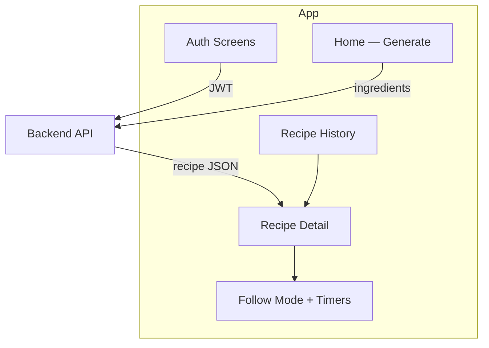

# Smart Ingredient Recipe

Cross-platform mobile app built with Expo and React Native. Enter what's in your kitchen, get an AI-generated recipe, then follow it step-by-step with built-in timers.

Pairs with the backend API: [Smart-Ingredient-Recipe-backend](https://github.com/VaibhavSaini0/Smart-Ingredient-Recipe-backend)

**Production API:** `https://smart-ingredient-recipe-backend.onrender.com`

---

## Overview

| Layer | Technology |
|-------|------------|
| Framework | Expo 54, React Native 0.81 |
| Language | TypeScript |
| Navigation | React Navigation (drawer + native stack) |
| State | React Context (auth, active recipe, timers) |
| Storage | AsyncStorage (JWT persistence) |
| Audio | expo-av (timer completion sound) |
| Backend | REST API on Render |



---

## Features

- **Account management** — Sign up, login, profile view, logout
- **Smart recipe generation** — Submit 3+ comma-separated ingredients; Gemini returns a full recipe
- **Recipe detail** — Title, prep time, servings, ingredient list, numbered steps
- **Follow mode** — Step-by-step cooking view with optional per-step countdown timers
- **Timer alerts** — Sound notification when a step timer completes
- **Recipe history** — Browse and reopen past recipes tied to your account
- **Drawer navigation** — Home, History, Profile, Logout

---

## Prerequisites

- [Node.js](https://nodejs.org/) 18 or later
- [Expo CLI](https://docs.expo.dev/get-started/installation/) (included via `npx`)
- **For mobile testing:** [Expo Go](https://expo.dev/go) on your phone, or Android Studio / Xcode for emulators

The backend can run locally or use the deployed Render instance — no Gemini key is needed in the app itself.

---

## Quick Start

### 1. Install dependencies

```bash
npm install
```

### 2. Configure environment

```bash
cp .env.example .env
```

Default `.env` points at the live backend:

```env
EXPO_PUBLIC_API_URL=https://smart-ingredient-recipe-backend.onrender.com
```

> After changing `.env`, restart Expo with a cleared cache: `npx expo start -c`

### 3. Start the dev server

```bash
npm start
```

Then choose a target:

| Platform | Command / action |
|----------|------------------|
| Expo Go (phone) | Scan the QR code (same Wi-Fi as your PC) |
| Android emulator | Press `a` or run `npm run android` |
| iOS simulator | Press `i` or run `npm run ios` (macOS only) |
| Web browser | Press `w` or run `npm run web` |

---

## Environment Variables

| Variable | Required | Description |
|----------|----------|-------------|
| `EXPO_PUBLIC_API_URL` | Yes (production builds) | Backend base URL, no trailing slash |

### Common configurations

```env
# Deployed backend (default)
EXPO_PUBLIC_API_URL=https://smart-ingredient-recipe-backend.onrender.com

# Local backend — web or emulator
EXPO_PUBLIC_API_URL=http://localhost:3000

# Local backend — physical device on same Wi-Fi
EXPO_PUBLIC_API_URL=http://192.168.1.42:3000
```

Replace `192.168.1.42` with your computer's LAN IP. Find it with `ipconfig` (Windows) or `ifconfig` (macOS/Linux).

In development, if `EXPO_PUBLIC_API_URL` is unset, the app falls back to `http://localhost:3000`. Production builds require HTTPS.

---

## Running with a Local Backend

If you want full local control (your own MongoDB + Gemini key):

```bash
cd ../Smart-Ingredient-Recipe-backend
npm install
cp .env.example .env
# Edit .env — set MONGODB_URI, JWT_SECRET, GEMINI_API_KEY
npm run dev
```

Then point the app at your backend:

```env
EXPO_PUBLIC_API_URL=http://localhost:3000
# or http://YOUR_LAN_IP:3000 for a physical device
```

See the [backend README](https://github.com/VaibhavSaini0/Smart-Ingredient-Recipe-backend) for full API setup.

---

## Scripts

| Command | Description |
|---------|-------------|
| `npm start` | Start Expo dev server |
| `npm run android` | Build and run on Android |
| `npm run ios` | Build and run on iOS simulator |
| `npm run web` | Run in the browser |

---

## Building for Release

[EAS Build](https://docs.expo.dev/build/introduction/) profiles are configured in `eas.json`. Preview and production builds embed the production API URL automatically.

```bash
# Install EAS CLI (once)
npm install -g eas-cli

# Log in to Expo
eas login

# Build an Android APK (preview)
npx eas build -p android --profile preview

# Production build (auto-increments version)
npx eas build -p android --profile production
```

Before publishing to app stores, update bundle identifiers in `app.json`:

- iOS: `expo.ios.bundleIdentifier`
- Android: `expo.android.package`

---

## Project Structure

```
Smart-Ingredient-Recipe/
├── App.tsx                 # Root component
├── app.json                # Expo config
├── eas.json                # EAS build profiles
├── src/
│   ├── api/                # HTTP client, auth + recipe endpoints
│   ├── components/         # Button, Input, StepTimer, ScreenWrapper, …
│   ├── constants/          # Theme colors, API base URL
│   ├── context/            # AuthContext, RecipeContext (timers, active recipe)
│   ├── navigation/         # Drawer, auth stack, app navigator
│   ├── screens/
│   │   ├── auth/           # Login, Signup
│   │   ├── recipe/         # Home, Detail, Follow, History
│   │   └── profile/        # User profile
│   ├── types/              # Shared TypeScript types
│   └── utils/              # Validation, timer sound, formatting
└── .env.example
```

---

## User Flow

1. **Sign up or log in** — JWT is stored in AsyncStorage for subsequent requests
2. **Home** — Enter ingredients (e.g. `chicken, rice, garlic, soy sauce`)
3. **Generate** — App calls `POST /api/recipes/generate`; recipe is saved server-side
4. **Recipe detail** — Review ingredients and steps; tap **Follow Recipe**
5. **Follow mode** — Advance step-by-step; start timers where suggested
6. **History** — Reopen any past recipe from the drawer

---

## Troubleshooting

| Issue | Fix |
|-------|-----|
| Stale API URL after editing `.env` | Kill port 8081, run `npx expo start -c`, hard-refresh browser |
| Network error on physical device | Use LAN IP in `EXPO_PUBLIC_API_URL`, not `localhost` |
| First API request very slow | Render free tier sleeps; allow ~30–60 s for cold start |
| Recipe generation fails | Check backend logs and `GEMINI_API_KEY` on the server |
| `EXPO_PUBLIC_API_URL must use HTTPS` | Production builds require an `https://` URL |
| Metro bundler cache issues | `npx expo start -c` |

---

## Related

Backend API: [Smart-Ingredient-Recipe-backend](https://github.com/VaibhavSaini0/Smart-Ingredient-Recipe-backend)
